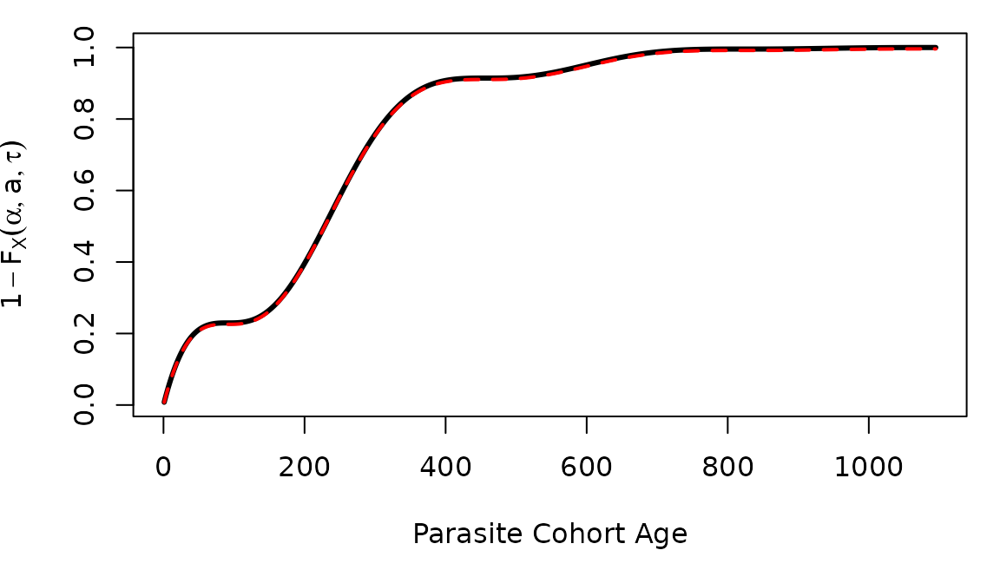
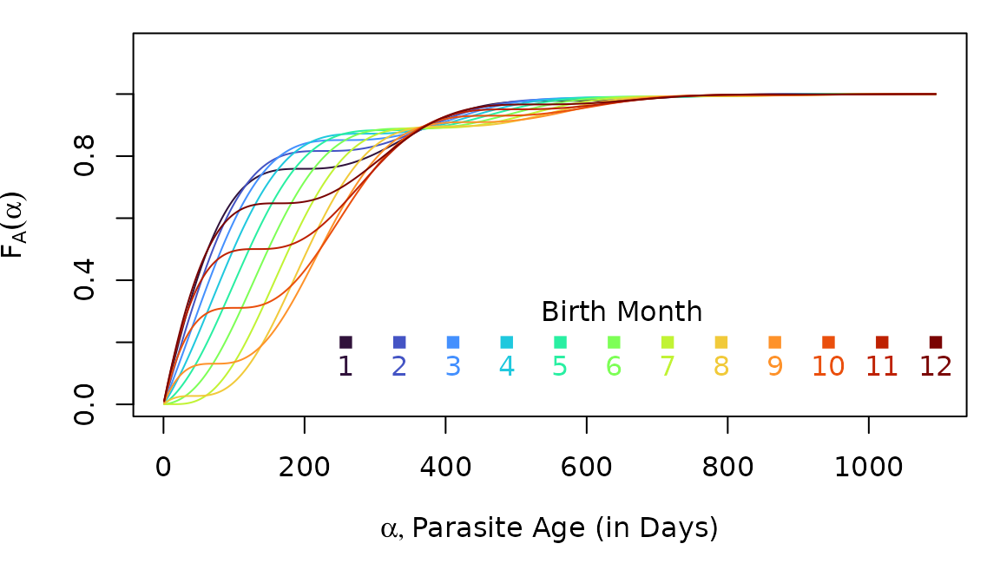
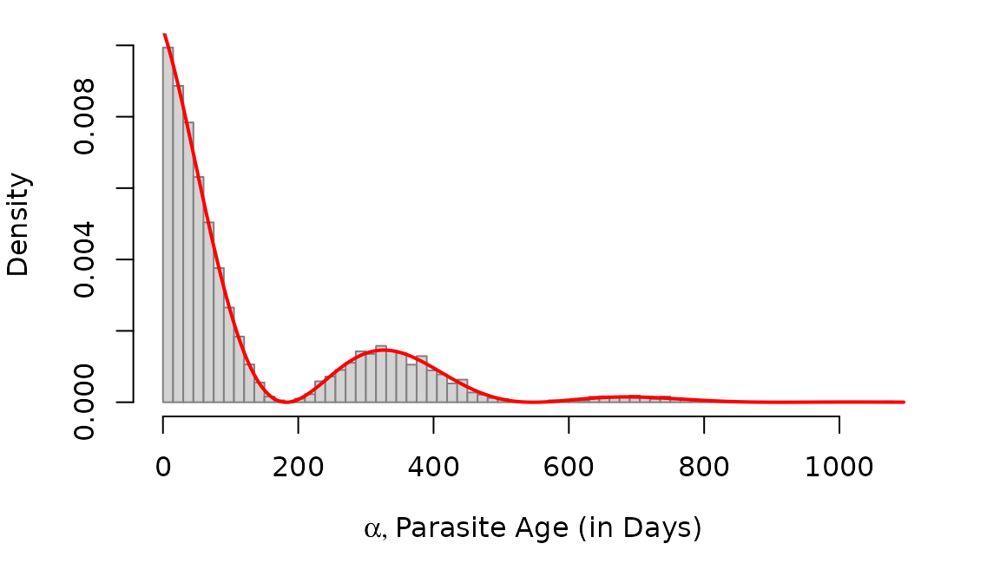
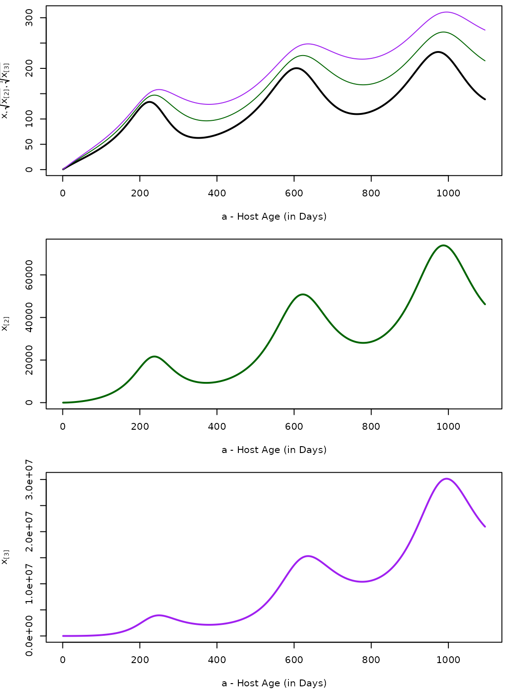
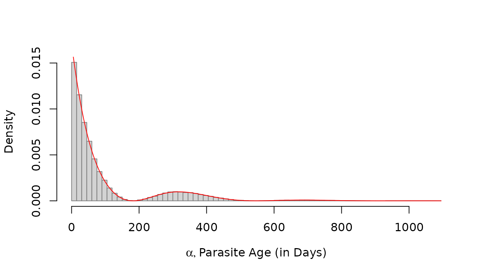

# Random Variables for Parasite Infection Dynamics

We have derived mathematical formulas that describe the dynamics of
malaria infections as random variables in cohorts of humans as they age
(Henry JM, *et al.*, 2024)[^1] This R package is the computational
companion.

In the following, we review the mathematical formulas and the functions
in `ramp.falciparum` that compute the multiplicity of infection (MoI),
the age of infection (AoI), and the age of the youngest infection (AoY).

## Formulas and Computation

1.  Let $`z_\tau(\alpha,a)`$ denote the density for infections of age
    $`\alpha`$ in a host cohort of age $`a`$ born on day $`\tau`$.

    - The dynamics of $`z(\alpha,a)`$ are described by the following:
      ``` math
      \frac{\partial z}{\partial a} + \frac{\partial z}{\partial \alpha} = - r z
      ```
      with the boundary condition:
      ``` math
      \begin{equation}
       z_\tau(0,a) = h_\tau(a).
      \end{equation}
      ```
      Its solutions are given by:
      ``` math
      z_\tau(\alpha,a) = h_\tau(a-\alpha) e^{-r \alpha}
      ```

    - The function `zda` computes $`z_\tau(\alpha, a).`$

2.  The mean MoI is given by the formula:
    ``` math
    m_\tau(a) = \int_0^a z_\tau(\alpha, a) d \alpha
    ```

    - The distribution of the MoI is Poisson (Nåsell I, 1985)[^2] with
      mean $`m_\tau(a).`$

    - The function `meanMoI` computes $`m_\tau(a)`$ using `zda`

3.  The true prevalence is the
    ``` math
    p_\tau(a) = 1 - e^{-m_\tau(a)} 
    ```
    The function `truePR` computes the true prevalence using `meanMoI`

4.  The density function for the age of infection (AoI) is
    ``` math
    A_\tau(a) \sim f_A(\alpha, a, \tau) = \frac{z_\tau(\alpha,a)}{m_\tau(a)}
    ```
    and its moments are
    ``` math
    x_n(a, \tau | h) = \int_0^a  \alpha^n f_A(\alpha, a, \tau) d \alpha
    ```

5.  The age of the youngest infection (AoY) is defined as:
    ``` math
    Y_\tau(a) \sim f_Y(\alpha, a, \tau) = \min_{\zeta \sim M_\tau(a)} \left\{ \alpha_i \right\}_{i=1}^\zeta,  \alpha_i \sim A_\tau(a) 
    ```

    - The density function can be expressed in terms of the density and
      distribution functions of the AoI and MoI.
      ``` math
      f_Y(\alpha; a, \tau) = 
      f_A(\alpha, a,\tau) e^{-m_\tau(a) F_A(\alpha, a,\tau)} \frac{m_\tau(a)}{p_\tau(a)}.
      ```

    - The distribution function for the AoY is:
      ``` math
      F_Y(a) \sim
      \frac{1-e^{-m_\tau(a)F_A(\alpha, a,\tau)}}{1-e^{-m_\tau(a)}} = 
      \frac{1-e^{-m_\tau(a)F_A(\alpha, a,\tau)}}{p_\tau(a)} 
      \label{FY}
      ```

    - Its moments are:
      ``` math
      y_n(a, \tau | h) = \int_0^a  \alpha^n f_Y(\alpha | a, \tau, h) d \alpha 
      ```

6.  We also developed functions to compute the age of the youngest of
    $`N`$ infections, called YoN
    ``` math
    N_\tau(a) \sim
    \min_{N} \left\{ \alpha_i \right\}_{i=1}^N \mbox { where }  \alpha_i \sim A_\tau(a) 
    ```

    - The distribution function for YoN, $`N_\tau(a)`$, is
      ``` math
      F_N(\alpha, a, t) \sim 1- (1-F_A(\alpha, a, \tau))^N
      ```
      The following is a summary table of functions to compute the MoI,
      AoI, AoY, and all their moments.

    - The density function for YoN is found by differentiating:

``` math
f_N(\alpha, a, t) \sim N (1-F_A(\alpha, a, \tau))^{N-1}\frac{f_A(\alpha, a, \tau)}{m_\tau(a)}
```

## Quick Reference

The following is a summary table of functions to compute the MoI, AoI,
AoY, YoN, and all their moments.

|  | MoI | AoI | AoY | YoN |
|----|:--:|:--:|:--:|:--:|
|  | $`\zeta`$ | $`\alpha`$ | $`\alpha`$ | $`\alpha`$ |
|  | $`\zeta \geq 0`$ | $`0 \leq \alpha \leq a`$ | $`0 \leq \alpha \leq a`$ | $`0 \leq \alpha \leq a`$ |
| Random Variable | $`M_\tau(\zeta, a, h)`$ | $`A_\tau(\alpha, a, h)`$ | $`Y_\tau(\alpha, a , h)`$ | $`N_\tau(\alpha, a, h)`$ |
| Density Function | $`f_M(\zeta, a, h)`$ | $`f_A(\zeta, a, h)`$ | $`f_Y(\zeta, a, h)`$ | $`f_N(\zeta, a, h)`$ |
|  | dpois | dAoI | dAoY | dYoN |
| Distribution Function | $`F_M(\zeta, a, h)`$ | $`F_A(\zeta, a, h)`$ | $`F_Y(\zeta, a, h)`$ | $`F_N(\zeta, a, h)`$ |
|  | ppois | pAoI | pAoY | pYoN |
| Random Numbers | $`\hat M_\tau(\zeta, a, h)`$ | $`\hat A_\tau(\alpha, a, h)`$ | $`\hat Y_\tau(\alpha, a , h)`$ | $`\hat N_\tau(\alpha, a , h)`$ |
|  | rpois | rAoI | rAoY | rYoN |
| Moments | $`m_\tau(a, h)`$ | $`x_n(a, \tau, h)`$ | $`y_n(a, \tau, h)`$ |  |
|  | meanMoI | momentAoI | momentAoY |  |

## Demonstration

### Force of Infection (FoI)

To compute anything, we must first set up a function to describe
exposure (see the
[FoI](https://dd-harp.github.io/ramp.falciparum/articles/FoI.md)
vignette). We define functions that plot the FoI for a cohort as it ages
(in red), but we can also compute the population average FoI (in black).
Different cohorts would experience different histories of exposure.


### Computing `zda`

The function `ramp.falciparum::zda(alpha, a, FoIpar, ...)` uses the
formula in Eq. 1 to compute the density of parasite infections in a
cohort of humans as it ages.

Using `zda,` we can compute the density of parasites in a cohort of any
age without solving a full system of equations. Given a function
describing the FoI in the population, $`h(t)`$, and the cohort birthday,
$`\tau.`$

``` r

alpha = 60
a = 6*365
zda(60, 6*365, foiP3) 
```

    ## [1] 0.001601196

The following computes the density of infections of every age in a
cohort of age 3.

``` r

zz = zda(a3years, max(a3years), foiP3)
```

When we plot $`z_\tau(\alpha, a)`$, we note that as $`\alpha`$ grows
larger, the parasite cohort gets older. When we plot parasite cohorts by
age, time is going backwards on the x-axis.


Now, we can imagine what `zda` would look like for several different
host cohorts at age three, but who were born at different times. In
effect, we are taking a snapshot of the cohorts at the same age, but at
different times.

The curves are different because the hosts were born at different
months, and they thus experienced different levels of exposure over the
first two years of life. Here the annual FoI is 5 infections, per
person, per year ($`\bar h = 5/365`$):


## Multiplicity of Infection (MoI)

We define a random variable $`M`$ describing the multiplicity of
infection (MoI). The distribution of the MoI is Poisson (see the
[MoI](https://dd-harp.github.io/ramp.falciparum/articles/MoI.md)
vignette).

``` math
M_\tau(a) \sim f_M(\zeta; a, \tau) = \mbox{Pois}(m_\tau(a))
```

Since $`z_\tau(\alpha, a)`$ describes the density of *all* infections of
age $`\alpha`$ in a cohort of age $`a`$, the density of all infections
must be the MoI. Since $`0 \leq \alpha < a`$, it must be true that:

``` math
\begin{equation}
\tag{2}
m_\tau(a) = \int_0^a z_\tau(\alpha, a) d \alpha
\end{equation}
```

The function that computes $`m_\tau(a)`$ is called `meanMoI.`

``` r

mm = meanMoI(a3years, foiP3, hhat=5/365)
```

Here, we plot the average MoI in the host cohort as it ages:


## Age of Infection (AoI)

We define a random variable $`A_\tau(a)`$ that describes the age of
infection (AoI), which is given by the formula

``` math
A_\tau(a) \sim f_A(\alpha; a, \tau) = \frac{z_\tau(\alpha,a)}{m_\tau(a)}
```

### The Density Function, `dAoI`

We can compute $`A_\tau(a)`$ using the density function `dAoI`:

``` r

f_A = dAoI(a3years, max(a3years), foiP3)
```


Now, as we plot the distribution of the AoI in cohorts at age two, born
at different months (as we did above), we notice that the distributions
have changed shapes:


### The Distribution Function, `pAoI`

The distribution function for $`A_\tau(a)`$ is:

``` math
F_A(a) \sim \int_0^\alpha f_A(\alpha; a, \tau) d\alpha
```

``` r

F_A = pAoI(a3years, max(a3years), foiP3)
```

If our functions work correctly, then we should get approximately the
same answer from computing the cumulative sum of `dAoI.`

``` r

F_A_alt = cumsum(f_A)
```

We shouldn’t expect the answers to be exactly the same, but they should
be close, with the `pAoI` in black.

``` r

par(mar = c(5,4,1,1))

plot(a3years, F_A, type = "l", 
     xlab = "Parasite Cohort Age", 
     ylab = expression(1-F[X](alpha, a, tau)), lwd=3)

lines(a3years, F_A_alt, col = "red", lwd=2, lty =2)
```




### Random Numbers, `rAoI`

The function `rAoI` uses `pAoI` to generate random numbers from
$`F_A(\alpha)`$

``` r

rhx = rAoI(10000, 3*365, foiP3)
```

A simple visual check computes the empirical CDF for the random variates
against $`F_A(\alpha)`$ computed using `pAoI`

``` r

par(mar = c(5,4,1,2))
plot(stats::ecdf(rhx), xlim = c(0,1095), cex=0.2, main = "", 
     xlab = expression(list(alpha, paste("Parasite Age (in Days)"))), 
     ylab = expression(list(F[A](alpha), paste("ecdf"))))
lines(a3years, F_A, col = "red", lty = 2, lwd=2)
```



We can also plot the distribution functions.


### AoI Moments

Let $`x`$ denote the first moment of of $`A_\tau(a)`$:
``` math
x_\tau(a) = \left< A_\tau(a) \right> = \int_0^\infty \alpha \frac{z_\tau(\alpha, a)} {m_\tau(a)}
```

Similarly, we let $`x_\tau(a)[n]`$ denote the higher order moments of
$`A_\tau(a)`$:
``` math
x_{[n]}(a, \tau) = \int_0^\infty \alpha^n \frac{z_\tau(\alpha, a)} {m_\tau(a)}
```

``` r

moment1 = momentAoI(a3years, foiP3)
moment2 = momentAoI(a3years, foiP3, n=2)
moment3 = momentAoI(a3years, foiP3, n=3)
```

The first three moments of the AoY plotted over time. In the top plot,
we’ve also plotted the $`n^{th}`$ root of the $`n^{th}`$ moment.



## Age of the Youngest Infection (AoY)

We have derived a random variable $`Y_\tau(a)`$ describing the age of
the youngest infection (AoY). The density function for the AoY is:

``` math
Y_\tau(a) \sim f_Y(\alpha; a, \tau) = f_A(\alpha, a,\tau) e^{-m_\tau(a) F_A(\alpha, a,\tau)} \frac{m_\tau(a)}{p_\tau(a)}
```
The distribution function is:

``` math
F_Y(a) \sim
\frac{1-e^{-m_\tau(a)F_A(\alpha, a,\tau)}}{1-e^{-m_\tau(a)}} = 
\frac{1-e^{-m_\tau(a)F_A(\alpha, a,\tau)}}{p_\tau(a)} 
```

The derivations are found in a Suppplement to Henry JM, *et al.* (2024).

The mean AoY is:

``` math
\left< Y_\tau(a) \right> = \int_0^a \alpha \; f_Y(\alpha, a, \tau) \; d\alpha 
```

And the higher order moments for the AoY are:

``` math
\left< Y_\tau(a)^n \right> = \int_0^n \alpha^n \; f_y(\alpha, a, \tau) \; d\alpha 
```

### AoY Density, `dAoY`

The density function is computed with the function `dAoY.`

``` r

f_Y = dAoY(a3years, 3*365, foiP3)
```

We can compare $`f_Y(\alpha)`$ (in black) to $`f_A(\alpha)`$ (in grey).



### Random Variables, `rAoY`

``` r

raoy = rAoY(10^5, 3*365, foiP3)
```

``` r

hist(raoy, breaks=seq(0, 1095, by = 15), 
     right=F, probability=T, main = "", 
     xlab = expression(list(alpha, paste("Parasite Age (in Days)"))), 
     border = grey(0.5)) -> out
lines(a3years, f_Y, type = "l", col = "red") 
```


### AoY Moments

``` r

aa = seq(5, 3*365, by = 5) 
moment1y = momentAoY(aa, foiP3)
moment2y = momentAoY(aa, foiP3, n=2)
moment3y = momentAoY(aa, foiP3, n=3)
```

The first three moments of the AoY plotted over time. In the top plot,
we’ve also plotted the $`n^{th}`$ root of the $`n^{th}`$ moment.



------------------------------------------------------------------------

**Next:**

- In the vignette
  [MoI](https://dd-harp.github.io/ramp.falciparum/articles/MoI.md), we
  show that the mean MoI computed using the formula in Eq. 2 gives the
  same answer as other approaches.

[^1]: Henry JM, Carter AR, Wu SL, Smith DL (in preparation). A
    Probabilistic Synthesis of Malaria Epidemiology: Exposure,
    Infection, Parasite Densities, and Detection.

[^2]: Nåsell I (1985). Hybrid Models of Tropical Infections, 1st
    edition. Springer-Verlag.
    <https://doi.org/10.1007/978-3-662-01609-1>
