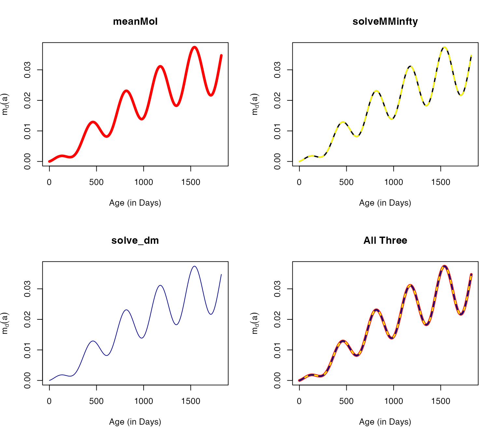
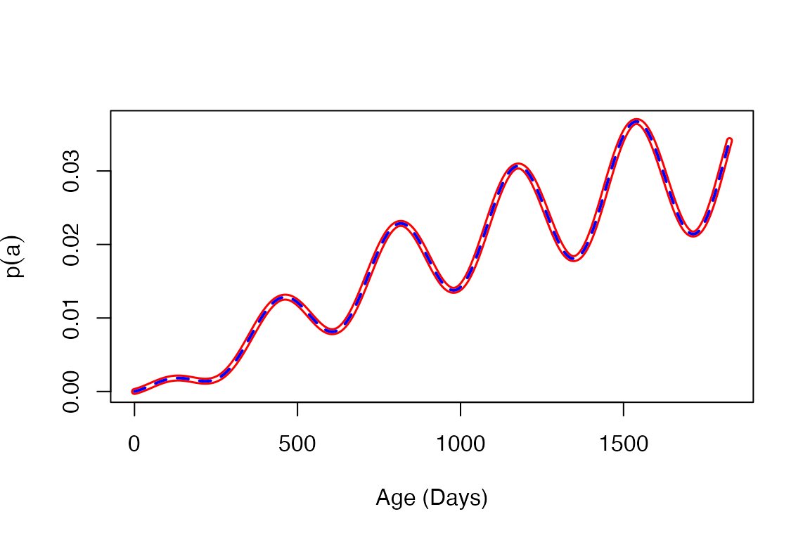
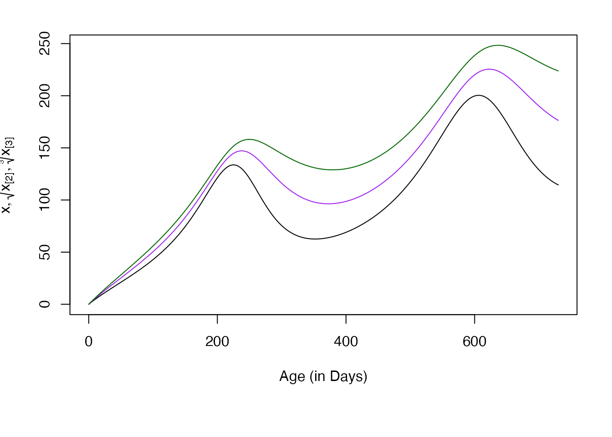
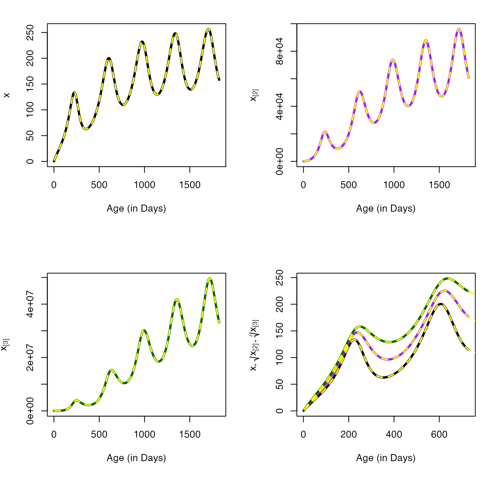
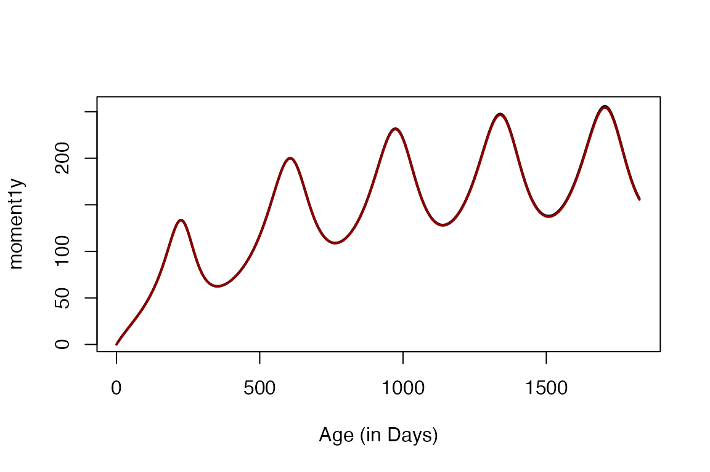

# Hybrid Models

``` r

library(ramp.falciparum)
library(ramp.func)
library(deSolve)
library(knitr)
```

``` r

# devtools::load_all()
```

## Introduction

In the following, we review hybrid models for the MoI, make a brief
observation about prevalence, and then derive hybrid variables for the
mean and higher order moments for the AoI.

## MoI

The random variable $`M`$ describes the distribution of the MoI in a
population, which follows a Poisson. Here, we provide a numerical
demonstration that this novel computational approach is equivalent to
the queuing model $`M/M/\infty`$, and that it is also equivalent to
hybrid models for the multiplicity of infection (Nåsell, I. 1985)[^1]:

### $`M/M/\infty`$

Elsewhere, the dynamics of MoI have be described using the queuing model
$`M/M/\infty`$. The MoI increases with the FoI, and each parasite can
clear at some rate, $`r`$. The following is a diagram for the changes in
the fraction of the population with MoI $`=i`$, denoted $`\zeta_i`$,
change in a host cohort with the force of infection $`h_d(a),`$ and with
clearance.

------------------------------------------------------------------------

\$\$\begin{equation} \begin{array}{ccccccccc} \zeta_0 & {h\atop
\longrightarrow} \atop {\longleftarrow \atop r} & \zeta_1 & {h\atop
\longrightarrow} \atop {\longleftarrow \atop {2r}} & \zeta_2 & {h \atop
\longrightarrow} \atop {\longleftarrow \atop {3r}} & \zeta_3 & {h \atop
\longrightarrow} \atop {\longleftarrow \atop {4r}}& \ldots \end{array}
\end{equation}\$\$

------------------------------------------------------------------------

The master equations for $`M/M/\infty`$ are:\
``` math
\begin{equation}
\begin{array}{rl}
\frac{d\zeta_0}{da} &= -h_d(a) \zeta_0 + r \zeta_1   \\ 
\frac{d\zeta_i}{da} &= -\left( h_d\left(a\right) + r i \right) \zeta_i + h_d\left(a\right) \zeta_{i-1} + r\left(i+1\right) \zeta_{i+1}   \\ 
\end{array}
\end{equation}
```

While the master equations describe an infinite set of equations, to
find numerical solutions, we must solve a finite set of equations. We
need to compute a maximum MoI that has a vanishingly small portion of
the distribution. For a constant $`h`$, the steady state distribution of
$`\zeta`$ is Poisson with mean $`h/r.`$ If we set $`N = \max(4h/r,24),`$
the tail is negligible. Here, we set the range to $`1 \pm 10^{-7}`$ and
plot the portion of the distribution covered.

``` r

m = seq(0.1, 24)
N = pmax(24, 4*m)
plot(m, ppois(N,m), type = "l", ylim = c(1-1e-07,1+1e-07))
```


We must define a trace FoI function.


To verify it works, we compute the MoI each day for the first three
years of life.

``` r

solveMMinfty(3/365, FoI_a) -> out
```

We peek at the distribution of MoI = $`1, \ldots, 5`$ on day 500:


### Nåsell’s Hybrid Model

We can also solve the hybrid equation to get the mean MoI (Nåsell, I.
1985)$`^1`$:

``` math
\frac{dm}{da} = h - rm
```

The unction `dmda` computes the derivative, and we can solve the hybrid
equation using `solve_dm` and plot the output:

``` r

solve_dm(3/365, FoI_a) -> mt 
plot(mt$time, mt$m, type = "l", 
     xlab = "Age (in Days)", ylab = expression(m[d](a)))
```


### Numerical Verification

We have presented three ways of computing the mean MoI using in a cohort
as it ages for an arbitrary function $`h_d(a)`$:

1.  Using `meanMoI` which integrates `zda`:

``` math
\int_0^a z_d(\alpha, a) d\alpha
```

2.  By solving the queuing model $`M/M/\infty`$, a compartmental model
    that tracks the full distribution of the MoI, and then competing the
    mean:

3.  By solving a hybrid model tracking the mean MoI.

``` r

aa = 0:1825
v1 = meanMoI(aa, FoI_a, hhat=5/365)
v2 = solveMMinfty(5/365, FoI_a, Amax=1825)$m
v3 = solve_dm(5/365, FoI_a, Amax=1825)[,2]
```

The following plots all three on the same graph using different colors
with different widths, colors, and patterns:

``` r

par(mfrow = c(2,2))

plot(aa, v1, type = "l", col = "red", lwd=4, 
     xlab = "Age (in Days)", 
     ylab = expression(m[d](a)), 
     main = "meanMoI")

plot(aa, v2, type = "l", lwd=2, 
     xlab = "Age (in Days)", 
     ylab = expression(m[d](a)), 
     main = "solveMMinfty")
lines(aa, v2, type = "l", col = "yellow", lwd=2, lty=2)

plot(aa, v3, type = "l", col = "darkblue", lwd=1, 
     xlab = "Age (in Days)", 
     ylab = expression(m[d](a)), 
     main = "solve_dm")

plot(aa, v1, type = "l", col = "red", lwd=4, 
     xlab = "Age (in Days)", 
     ylab = expression(m[d](a)), 
     main = "All Three")
lines(aa, v2, type = "l", col = "yellow", lwd = 2)
lines(aa, v3, type = "l", col = "darkblue", lwd = 2, lty =2)
```



the maximum errors are on the order of $`1e-07`$

``` r

c(max(abs(v1-v2)), max(abs(v2-v3)), max(abs(v1-v3)))
```

    ## [1] 9.200345e-10 1.369981e-13 9.200345e-10

We have developed a hybrid model that we can use to compute the mean and
higher order moments for the age of infection (AoI). In a related
vignette
([AoI](https://dd-harp.github.io/ramp.falciparum/articles/AoI.md)), we
define the AoI as a random variable and develop functions to compute its
moments. Here, we develop a notation for the moments:

## Prevalence

George Maccdonald published a model of superinfection in 1950[^2]. In
presenting the model, Macdonald was trying to solve a problem: if
super-infection was possible, then how long would it take until a person
would clear all of the parasites to become uninfected again? Macdonald
proposed a solution, but there was a problem with the mathematical
formulation (An essay by Paul Fine, from 1975, is recommended
reading)[^3]: the model that Macdonald described didn’t match the
function he used. In a model formulated as part of the Garki project
(Dietz K, *et al.*, 1974)[^4], the model allowed for *superinfection*
and proposed a useful approximating model. One solution came from taking
a hybrid modeling approach (Nåsell I, 1985)[^5], which we have just
discussed.

Nåsell showed that the distribution of the MoI would converge to a
Poisson distribution:

``` math
M(t) \sim f_M(\zeta; m) = \mbox{Pois}(m(t))
```

Since $`m`$ is the mean of a Poisson, the prevalence of infection is the
complement of the zero term:

``` math
p(t) = 1-\mbox{Pois}(\zeta =0; m(t)) = 1 - e^{-m(t)}
```

It is, nevertheless, sometimes useful to know the clearance rate, a
transition from MoI = 1 to MoI=0. Clearance from the infected class can
only occur if a person is infected with an MoI of one, and if that
infection clears:

``` math
R(m) = r \frac{\mbox{Pr}(\zeta=1; m(t))}{\mbox{Pr}(\zeta>0; m(t))} = r \frac{m}{e^m - 1} 
```

The change in prevalence is thus described by the equation:

``` math
\frac{dp}{dt} = h(1-p)-R(m)p 
```

While this is interesting, and while it solves the problem of modeling
clearance under superinfection, the equation depends on $`m`$. Since we
can compute $`p(t)`$ directly from $`m(t)`$, the equation is redundant.

Code exists in `ramp.falciparum` to compute prevalence in three ways:

- Using the function `truePR`

- Using the hybrid equations `solve_dpda`

- From the hybrid model `solve_dm` and $`p(t)= 1 - exp(-m(t))`$



## AoI - Hybrid Variables

Let $`x = \left< A\right>;`$ x is the first moment of the AoI in a
cohort at age $`a`$, conditioned on a history of exposure, given by a
function $`h`$. In longer form:
``` math
x_d(a; h) = \left< A_d(a; h) \right> = \int_0^\infty \alpha \frac{z_d(\alpha, a; h_d(a))} {m_d(a;h_d(a))}
```
Here, we show that:

``` math
\frac{\textstyle{dx}}{\textstyle{da}} = 1- 
\frac{\textstyle{h}}{\textstyle{m}} x  
```

Similarly, we let $`x_{[n]} = \left< A^n \right>`$ denote the higher
order moments of the random variable $`A`$. In longer form:
``` math
x_{n}(a, d; h) = \int_0^\infty \alpha^n \frac{z_d(\alpha, a; h_d(a))} {m_d(a;h_d(a))}
```
We show that higher order moments can be computed recursively:

``` math
\frac{\textstyle{dx_{[n]}}}{\textstyle{da}} = nx_{[n-1]} -  
  \frac{\textstyle{h}}{\textstyle{m}} x_{[n]}
```

In the following, we first demonstrate that the hybrid equations give
the same answers as direct computation of the moments.

### Solving

The function `solve_dAoI` computes the first three moments of the AoI by
default. Here we plot the $`n^{th}`$ root of the first three moments.

``` r

par(mar = c(7, 4, 2, 2))
solve_dAoI(5/365, FoI_a) -> mt 
plot(mt$time, mt$xn1, type = "l", xlab = "Age (in Days)", ylab = expression(list(x, sqrt(x[paste("[2]")]), sqrt(x[paste("[3]")], 3))), ylim = range(mt$xn3^(1/3))) 
lines(mt$time, mt$xn2^(1/2), col = "purple")
lines(mt$time, mt$xn3^(1/3), col = "darkgreen") 
```



### Numerical Verification

``` r

aa = seq(5, 5*365, by = 5) 
moment1 = momentAoI(aa, FoI_a)
moment2 = momentAoI(aa, FoI_a, n=2)
moment3 = momentAoI(aa, FoI_a, n=3)
```

2.  By solving a hybrid model with variables that track the moments,
    using the equations that we derived above:

``` r

solve_dAoI(5/365, FoI_a, Amax = 5*365, dt=5) -> mt 
```

``` r

par(mfrow = c(2,2), mar = c(7, 4, 2, 2))
# Top Left
plot(mt$time, mt$xn1, type = "l", xlab = "Age (in Days)", ylab = expression(x), lwd=3) 
lines(aa, moment1, col = "yellow", lwd=2, lty=2) 
# Top Right 
plot(mt$time, mt$xn2, type = "l", xlab = "Age (in Days)", ylab = expression(x[paste("[2]")]), lwd=3, col = "purple") 
lines(aa, moment2, col = "yellow", lwd=2, lty=2)
plot(mt$time, mt$xn3, type = "l", lwd=3, col = "darkgreen",
     xlab = "Age (in Days)", ylab = expression(x[paste("[3]")]))
lines(aa, moment3, col = "yellow", lwd=2, lty=2)
par(mar = c(7, 4, 2, 2))
solve_dAoI(5/365, FoI_a) -> mt 
plot(mt$time, mt$xn1, type = "l", xlab = "Age (in Days)", ylab = expression(list(x, sqrt(x[paste("[2]")]), sqrt(x[paste("[3]")], 3))), lwd=3, ylim = range(mt$xn3^(1/3))) 
lines(mt$time, mt$xn2^(1/2), col = "purple", lwd=3)
lines(mt$time, mt$xn3^(1/3), col = "darkgreen", lwd=3) 
lines(aa, moment1, col = "yellow", lwd=2, lty=2)
lines(aa, moment2^(1/2), col = "yellow", lwd=2, lty=2)
lines(aa, moment3^(1/3), col = "yellow", lwd=2, lty=2)
```



## AoY - Hybrid Variables

Let $`y`$ denote the first moment of the AoY.

``` math
y_d(a) = \int_0^a \alpha \; f_Y(\alpha, a, d) \; d\alpha 
```

A differential equation for $`y_d(a)`$ is:

``` math
\frac{dy}{da} = 1 - \frac{h}{p} y + \phi(r,m) x 
```

Where $`\phi`$ computes the probability that an infection with
MoI$`\geq 2`$*increases* with a loss.

To verify, we can compute the moment directly. The function
`solve_dAoYda` gives solutions:

``` r

solve_dAoYda(5/365, FoI_a, Amax=5*365, dt=5, n=9) -> mt
```

The moments can be computed directly using `momentAoY`

``` r

moment1y = momentAoY(aa, FoI_a, hhat=5/365)
```

The following plots the first moment computed both ways:



## References

[^1]: Nåsell, I. (1985). Transmission Models for Malaria. In: Hybrid
    Models of Tropical Infections. Lecture Notes in Biomathematics, vol
    59. Springer, Berlin, Heidelberg.
    <https://doi.org/10.1007/978-3-662-01609-1_3>

[^2]: G Macdonald (1950). The analysis of infection rates in diseases in
    which superinfection occurs. Trop. Dis. Bull. 47, 907–915.

[^3]: Fine PEM (1975). Superinfection - a problem in formulating a
    problem. Tropical Diseases Bulletin 75, 475–488

[^4]: Dietz K, Molineaux L, Thomas A (1974). A malaria model tested in
    the African savannah. Bull. Wld. Hlth. Org. 50, 347–357.

[^5]: Nåsell I (1985). Hybrid Models of Tropical Infections, 1st
    edition. Springer-Verlag.
    <https://doi.org/10.1007/978-3-662-01609-1>
