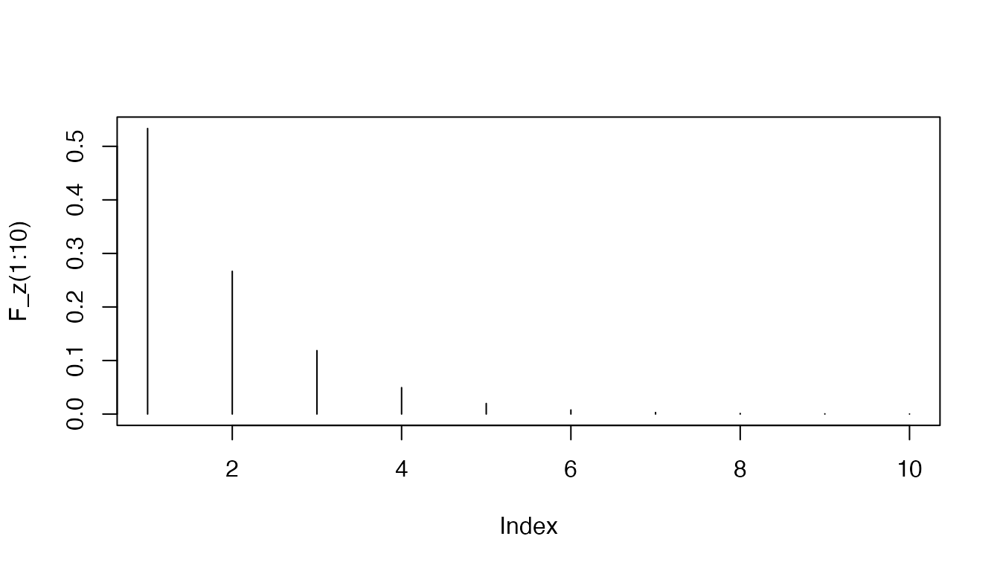
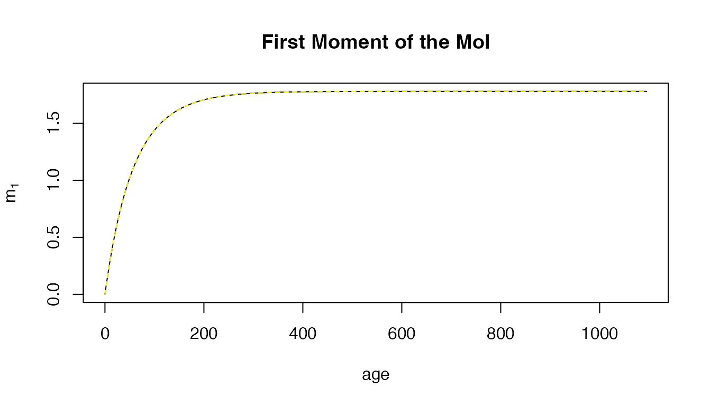
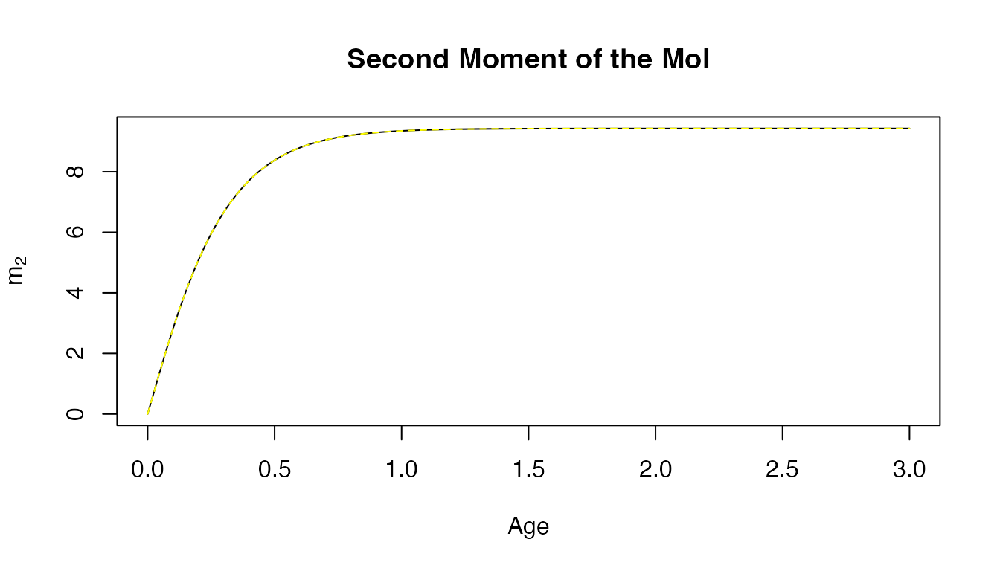
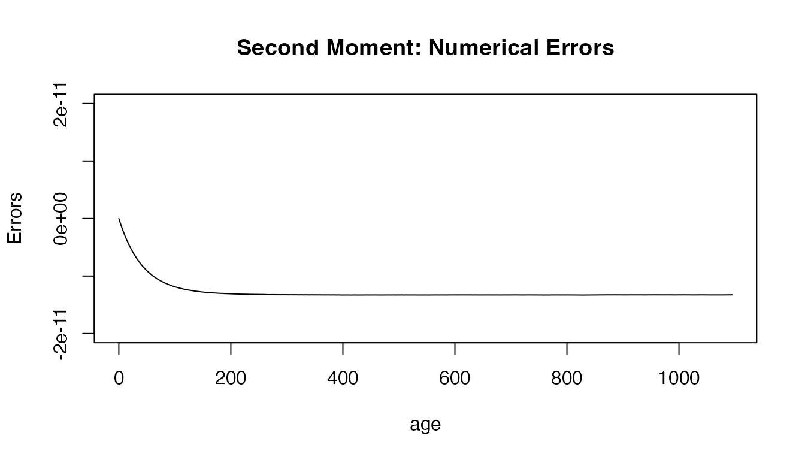
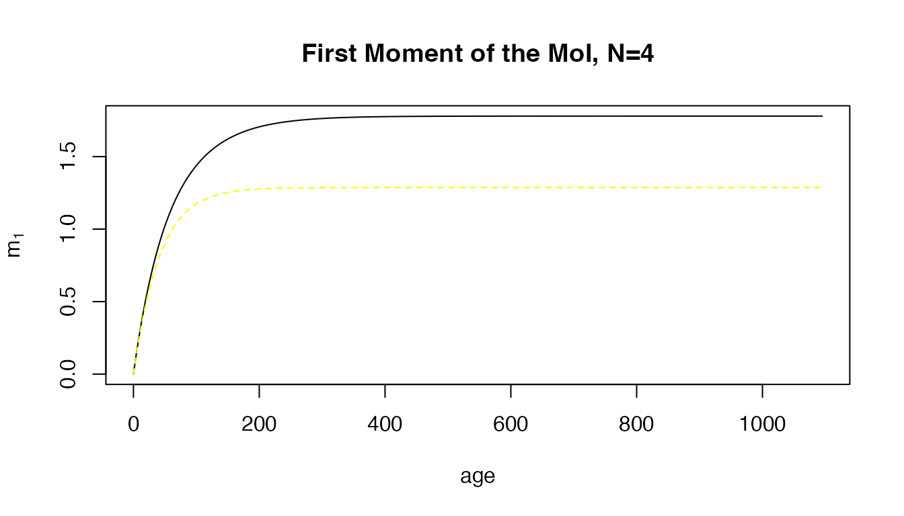

# SquIPz

------------------------------------------------------------------------

**SquIPz** is a dynamical system describing the dynamics of the
multiplicity of infection (MoI) in a cohort of humans as it ages.
**SquIPz** was developed by extending
[SquIPz](https://dd-harp.github.io/ramp.falciparum/articles/SquIPz.md)
to include heterogeneous exposure as a Tweedie Process. In-Line
documentation for **SquIPz** is accessed as:

    help(SquIPz)

**Implementation** — The file `SquIPz.R` defines two functions:

    dSquIPz 
    solve_SquIPz
    make_Z

This numerical implementation truncates the infinite system of
differential equations. To verify the code and check the accuracy of the
truncated system, we also derive and compute hybrid variables describing
the first few moments of the infinite system.

**Related**

- [SquIPz](https://dd-harp.github.io/ramp.falciparum/articles/SquIPz.md)

- SIPm

------------------------------------------------------------------------

## The Model

### Variables

The independent variable is age, $`a.`$

The dependent variables are:

- $`S`$ is the expected number uninfected and susceptible to infection

- $`P`$ is the expected number uninfected and chemo-protected

- $`I_i`$ is the expected number infected with $`i`$ clones

We let $`H`$ denote the expected population density of the cohort as it
ages:
``` math
H = S+P+\sum_i I_i.
```

Similarly, we introduce the variable $`I`$:

``` math
I = \sum_i I_i
```

### Initial Conditions

In the model, we assume that everyone is born susceptible. $`H`$ is
passed as a parameter, and the initial conditions are set to

- $`S(0) = H`$

- $`P(0) = 0`$

- $`I_i(0) = 0`$

### Mortality

The model assumes that all individuals die as they age at the rate
$`\mu`$, such that

``` math
\frac{\textstyle{dH}}{\textstyle{da}} = -\mu H
```

### Exposure and Infection

We let $`h`$ denote the force of infection (FoI). This model,
**SquIPz,** assumes that each incident infection increases the MoI by
exactly one. The model **SquIPz** implements exposure as a Tweedie
process.

The model assumes that each clone clears independently of the others at
rate $`r,`$ so for those infected with $`i`$ clones, the MoI goes down
by one at the rate $`ri.`$

### Treatment and Chemprotection

These equations assume that individuals are treated and cured for
several different reasons:

- Incident infections cause disease and a fraction $`\rho`$ gets treated

- Everyone in the population takes drugs at a background rate $`\xi`$

- In addition to other modes of treatment, infected individuals get
  treated at the higher rate $`\sigma`$

After being treated and cured, individuals enter the chemoprotected
class $`P.`$ Chemoprotection is lost at the rate $`\eta,`$ and they
enter the susceptible class $`S.`$

### Differential Equations:

Changes in the susceptible population are:

``` math
\frac{\textstyle{dS}}{\textstyle{da}}  = \eta P + r I_1 - (h + \xi + \mu) S
```

Changes in the chemoprotected population are:

``` math
\frac{\textstyle{dP}}{\textstyle{da}}  =  \left(h \rho + \xi \right) \left(H-P \right) + \sigma \sum_i I_i   - \left(\eta + \mu \right) P
```

Changes in the infected population are given by an infinite system of
equations. The first one is a special case:

``` math
\frac{\textstyle{dI_1}}{\textstyle{da}}  =  h(1-\rho)S + 2 r I_2 - (r + h + \xi + \sigma + \mu) I_1
```

for $`i>1`$:

``` math
\frac{\textstyle{dI_i}}{\textstyle{da}}  =  h(1-\rho)I_{i-1} + (i+1) r I_{i+1} - (i r + h + \xi + \sigma + \mu) I_1
```

## Implementation and Verification

In this implementation, the infinite system of equations is truncated at
$`N.`$ For the last differential equation $`I_N,`$ no new infections
occur ($`h=0`$) and there is no $`I_{N+1}`$ so nothing is added from
above:

``` math
\frac{\textstyle{dI_N}}{\textstyle{da}}  =  h(1-\rho)I_{N-1} - (N r + \xi + \sigma + \mu) I_N
```

In the implementation, if no value for $`N`$ is passed, it is set to

    N = round(max(10*h/r,20))

### Hybrid Variables:

This implementation also computes several other variables: Let
``` math
I = \sum_i I_i
```

The dynamics of the hybrid variable $`I`$ are:

``` math
\frac{\textstyle{dI}}{\textstyle{da}}  =  h(1-\rho)S - r I_1 - (\rho h+\xi+\sigma+\mu)I
```

Let $`m_n`$ denote the $`n^{th}`$ moment of the distribution of the MoI:

``` math
m_n = \frac{\textstyle{1}}{\textstyle{H}}\sum_i i^n  I_i
```

With some algebra (see below), we can derive an equation for the
dynamics of the hybrid variable $`m_1`$ are:
``` math
\frac{\textstyle{dm_1}}{\textstyle{da}}  =  h(1-\rho)\left(1-\frac{\textstyle{P}}{\textstyle{H}}\right) - \left(r + h \rho +\sigma + \xi\right) m_1
```

Similarly, we can compute the dynamics of $`m_2:`$

``` math
\frac{\textstyle{dm_2}}{\textstyle{da}}  =  h(1-\rho)\left( 1- \frac{\textstyle{P}}{\textstyle{H}} + 2 m_1\right)  - \left(2r + h \rho + \sigma + \xi \right) m_2 + r m_1
```

The dynamics of the hybrid variables, $`I,`$$`m_1,`$ and $`m_2`$ are
verified by solving the equations and using the formulas to compute
their values.

## Derivations

### Change of Variables

``` math
\begin{array}{ccc}
I &=   & \sum_i I_i  \\[6pt]
m &=    & \sum_i i I_i /H\\[6pt]
m_2 &=    & \sum_i i^2 I_i /H\\
\end{array}.
```

#### Infected

``` math
\frac{dI}{da} =\begin{array}{l} 
h(1-\rho) S \sum_i z_i \\
- \sum_i \left(h +\sigma + \xi + \mu\right) I_i  \\
- r I_1 - \sum_i -ri I_i + (i+1) r I_{i+1} \\ 
+ h(1-\rho)\sum_i \sum_{j<i} I_{i-j} z_j\\
\end{array}
```
We can use some identities to simplify a lot:

``` math
\frac{dI}{da} =\begin{array}{l} 
h(1-\rho) S - \left(h + \sigma + \xi + \mu\right) I - r_1 I_1\\
- h(1-\rho)\sum_i \sum_{j<i} I_{i-j} z_j\\
\end{array}
```
but
``` math
\sum_i \sum_{j<i} I_{i-j} z_j = \sum_i \sum_j z_j I_i = I
```
so
``` math
\frac{dI}{da} =
h(1-\rho) S - \left(h \rho + \sigma + \xi + \mu\right) I - r_1 I_1
```

### Mean MoI

``` math
\frac{dm}{da} =\begin{array}{l} 
h(1-\rho) S \sum_i i z_i/H\\
- \sum_i \left(h +\sigma + \xi + \mu\right) i I_i /H \\
\sum_i i \left((i+1)r I_{i+1} - r_i I_i \right) /H \\ 
+ h(1-\rho)\sum_i \sum_{j<i} i I_{i-j} z_j\\
\end{array}
```

#### $`r`$ terms

For the terms involving $`r`$, we want to simplify
``` math
\sum_i i \left((i+1) r I_{i+1} - r i I_i \right) 
```
In long form, this is just
``` math
\begin{array}{l}
1\left(-r I_1 + 2r I_2 \right) \\ 
2 \left(-2r I_2 + 3r I_3\right) \\
3 \left(-3r I_3 + 4r I_4\right) \\
\end{array}
```
but this simplifies to
``` math
-r I_1 - 2r I_2 - 3r I_3 - \ldots = -rm  
```

``` math
\frac{dm}{da} =\begin{array}{l} 
h(1-\rho) S \hat z/H\\
- \sum_i \left(h +\sigma + \xi + \mu\right) m \\
- r I_1 + \sum_i \left((i+1) r (i+1) I_{i+1} - r_i I_i \right) /H \\ 
+ h(1-\rho)\sum_i \sum_{j<i} i I_{i-j} z_j\\
\end{array}
```

#### $`h`$ terms

``` math
h(1-\rho)\sum_i \sum_{j<i} i^2 I_{i-j} z_j
```
In long form, summing from $`I_i`$ we get
``` math
\begin{array}{c|l}
I_1 & - h I_1 + h (1-\rho) I_1 \left(2 z_1 + 3 z_2 + 4 z_3 + \ldots\right) \\
I_2 & - 2^2 h I_2 + h (1-\rho) I_2 \left(3^2 z_1 + 4^2 z_2 + 5^2 z_3 + \ldots\right) \\
\vdots & \vdots \\
I_i & - i^2 h I_i + h (1-\rho) I_i \left((i+1)^2 z_1 + (i+2)^2 z_2 + \ldots \right)
\end{array}
```
but since\
``` math
\sum_j (i+j) z_j = \sum_j i z_j + \sum_j j z_j =  i  + \hat z 
```

We can rewrite all this above as:
``` math
\begin{array}{c|l}
I_1 & - h I_1 + h (1-\rho) I_1 \left(1 + \hat z\right) \\
I_2 & - 2 h I_2 + h (1-\rho) I_2 \left(2 + \hat z\right) \\
\vdots & \vdots \\
I_i & - i h I_i + h (1-\rho) I_i \left(i + \hat z \right)
\end{array}
```
now dividing by $`H,`$ we get
``` math
 \frac{dm}{da} = - h m + h (1-\rho)m + h(1-\rho)\hat z \frac{S+I}{H} + \mbox{terms not involving } h
```

### MoI, Second Moment

``` math
\frac{dm}{da} =\begin{array}{l} 
h(1-\rho) S \sum_i i^2 z_i/H\\
- \sum_i \left(h +\sigma + \xi + \mu\right) i^2 I_i /H \\
\sum_i i^2 \left((i+1)r I_{i+1} - r_i I_i \right) /H \\ 
+ h(1-\rho)\sum_i \sum_{j<i} i^2 I_{i-j} z_j\\
\end{array}
```

#### $`h`$ terms

``` math
h(1-\rho)\sum_i \sum_{j<i} i I_{i-j} z_j
```
In long form, summing from $`I_i`$ we get
``` math
\begin{array}{c|l}
I_1 & - h I_1 + h (1-\rho) I_1 \left(2^2 z_1 + 3^2 z_2 + 4^2 z_3 + \ldots\right) \\
I_2 & - 2^2 h I_2 + h (1-\rho) I_2 \left(3^2 z_1 + 4^2 z_2 + 5^2 z_3 + \ldots\right) \\
\vdots & \vdots \\
I_i & - i^2 h I_i + h (1-\rho) I_i \left((i+1)^2z_1 + (i+2)^2 z_2 + \ldots \right)
\end{array}
```
but since\
``` math
\sum_j (i+j)^2 z_j = \sum_j i^2 z_j + \sum_j 2 i j z_j + \sum_j j^2 z_j =  i^2  + 2 i \hat z + \hat z_2
```

We can rewrite all this above as:
``` math
\begin{array}{c|l}
I_1 & - h I_1 + h (1-\rho) I_1 \left(1 + 1 \cdot 2  \hat z + \hat z_2\right) \\
I_2 & - 2^2 h I_2 + h (1-\rho) I_2 \left(2^2 + 2 \cdot 2 \hat z + \hat z_2 \right) \\
\vdots & \vdots \\
I_i & - i^2 h I_i + h (1-\rho) I_i \left(i^2 + i \cdot 2 \hat z + \hat z_2 \right)
\end{array}
```
now dividing by $`H,`$ we get
``` math
 \frac{dm_2}{da} = - h m_2 + h (1-\rho)\left(m_2 + 2 \hat z m + \hat z_2 \frac I H \right) +   h (1-\rho) \hat z_2 \frac{S}{H} + \mbox{terms not involving } h
```

The old correct formula was:
``` math
\frac{dm_2}{da} = h(1-\rho)\hat z \left(\frac{S + I}H + 2 m \right) - (2r + h\rho + \sigma + \xi)m_2 + r m 
```

### Numerical Verification

``` r

library(ramp.falciparum)
```

``` r

F_z = function(x, mu=1, size=2){return(dnbinom(x,mu=mu, size=size)/(1-dnbinom(0,mu=mu,size=size)))}
plot(F_z(1:10), type = "h") 
```



``` r

foiP1 = list(hbar = 1, agePar = par_flatAge(), 
             seasonPar = par_flatSeason(), 
             trendPar = par_flatTrend())

q_out <- solve_SquIPz(8/365, foiP1, F_z, sigma=2/365, xi=0, Amax=3*365, N=400)
```

For verification, the variable $`m_1`$ is computed two ways, and we\
we note that they match. To see it, we plotted both, one in solid black
and the other dashed yellow:

``` r

with(q_out, plot(age, m_1, type = "l", ylab = expression(m[1]), main = "First Moment of the MoI"))
with(q_out, lines(age, m1, lty=2, col = "yellow"))
```



Since it’s hard to see differences, we can simply plot the differences.
Here, we’ve set the limits to be $`10^{-14}`$ so we can visualize the
differences:

``` r

ylm = 1e-13
with(q_out, plot(age, m_1-m1, type = "l", ylab = "Errors", main = "First Moment: Numerical Errors", ylim = c(-ylm, ylm)))
```


``` r

with(q_out, plot(age/365, m_2, type = "l", main = "Second Moment of the MoI",
                 ylab = expression(m[2]), 
                 xlab = "Age", ylim = range(m_2, m2)))
with(q_out, lines(age/365, m2, lty=2, col = "yellow"))
```



``` r

ylm = 1e-10/5
with(q_out, plot(age, m_2-m2, type = "l", 
                 ylab = "Errors", 
                 main = "Second Moment: Numerical Errors", 
                 ylim = c(-ylm, ylm)))
```



We note that if we had truncated the system of equations at $`N=4,`$ the
moments diverge:

``` r

q1_out <- solve_SquIPz(8/365, foiP1, F_z, sigma=2/365, xi=0, Amax=3*365, N=4)
with(q1_out, plot(age, m_1, type = "l", 
                  ylab = expression(m[1]), 
                  main = "First Moment of the MoI, N=4"))
with(q1_out, lines(age, m1, lty=2, col = "yellow"))
```


